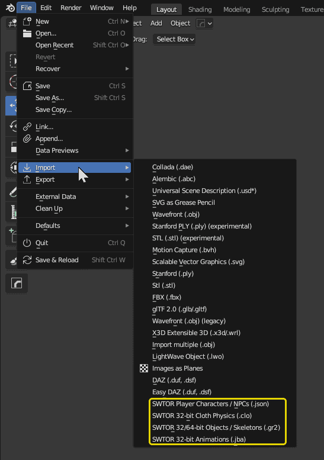

### WARNING: not yet compatible with Blender 4.1.x. We are working on that.

### IMPORTANT NOTICE: [the latest version of this importer add-on](https://github.com/SWTOR-Slicers/Granny2-Plug-In-Blender-2.8x/releases/latest) can import objects, characters, and skeletons from both the old 32 bit and the new 64 bit (Game Update 7.2.1 onwards) SWTOR game apps.<br><br>Importing animation files from the 64 bit game is going to take *long*. You can use the animation files from a 32 bit game assets extraction instead (if needed, there is a backup of the game's .tor files that can be downloaded from **[here](https://drive.google.com/drive/folders/1ZkBNz1cK_IXBxBd4OIYL1jRImnnfHXKW?usp=sharing)**.

# SWTOR Granny2 (.gr2) Import/Export Add-on for Blender 2.8 to 4.0

### New version with new features:
* Blender 4.0.x compatibility.
* Preferences and presets for preferred settings.
* Scale and axis order conversion at the mesh level.
* SWTOR Animations without 180º turn.
* Streamlined console output.
* New facilities for communicating data to other add-ons.

##Description




This add-on provides Blender with several import/export features for **Star Wars: The Old Republic** (**SWTOR**) 3D assets.

* **SWTOR .gr2 objects and armatures import:**  
  Imports and exports SWTOR's specific flavor of the .gr2 ("granny") 3D model format, including rigging data (vertex groups, weights) and armatures ("skeletons"). **It can import multiple files at once**.  
**SWTOR 32bit and 64bit-compatible**.

* **SWTOR .json character data import:**  
  Imports .json files generated by TORCommunity.com's Character Designer and NPC database describing all the assets and data necessary to auto-assemble and auto-texture a Player Character or a NPC. **Please check our guides in this Github's [**WikiPedia**](https://github.com/SWTOR-Slicers/WikiPedia/wiki/locating-swtor-characters-assets-automatically) before trying it!** It can be used directly, but there are other add-ons that do it for us in a more user-friendly manner.  
  **SWTOR 32bit and 64bit-compatible**.

* **SWTOR .jba animations import:**  
Imports and applies SWTOR's .jba animation files. It has some issues but it mostly works.  
  **SWTOR 32bit-compatible only**.
  
* **SWTOR .clo physics data import:**  
Imports SWTOR's .clo files for converting physics-based bones data (clothes, hair, Twi'lek lekku, etc.) to Blender physics simulations. **Experimental and extremely wonky, expect Kill Bill sirens!** (we are doing another attempt at doing something about it, but it'll take its good time)  
  **SWTOR 32bit-compatible only**.


**This add-on also produces a series of Shader Nodegroups that replicate SWTOR's materials system**. They allow for using the game's texture files and materials information without requiring any previous manipulation in a third party painting app: the Shaders do all the channel massaging involved (turning "green" normal maps to "purple", etc.).

The shaders are assigned on the fly when importing .json character data files for auto-assembling, and are also available through Blender's Shader Editor's Add menu.

## Download

[**Download the latest release from here**](https://github.com/SWTOR-Slicers/Granny2-Plug-In-Blender-2.8x/releases/latest). It's the ``io_scene_gr2.zip`` file in the latest release's Assets list. **DON'T UNZIP IT!** Blender directly handles it as such .zip file. 

## Installation

Install it in your Blender app **[through the usual means](https://docs.blender.org/manual/en/latest/editors/preferences/addons.html)** (Edit menu > Preferences > Add-ons > Install > Enable). If you had a previous version of the add-on installed, disable and remove it first).

**For directions on its usage, please consult our [**WikiPedia**](https://github.com/SWTOR-Slicers/WikiPedia/wiki).**

## Settings

This Add-on comes now with a series of 'quality-of-life' settings that, for certain uses of SWTOR assets (artistic, mostly), can save us a lot of work. **All settings have tooltips explaining their functions**. They are about dealing with the fact that SWTOR game assets usually come in sizes, axis order schemes, and other details, that require massaging to be able to work with some of Blender's more advanced features (physics simulations, non-SWTOR armatures-based custom rigs, etc.) that require things such as real world-like sizes or no 'soft' transforms getting in the way.

All that said, **the Add-on's default settings are perfectly fine** for having everything work as expected (**they match the behavior of previous versions**). Set to those, our other Add-ons (Character Assembler, Area Assembler, ZG SWTOR Tools) won't notice any difference.

### .gr2 objects/armatures/characters import settings:
* **Import Collision Mesh**: old option that used to be only available in the importer's file browser. 
* **Name Imported Objects as Filenames**: typically, the imported mesh's (or main mesh's) "art name" matches the filename, but not always, which leads to issues if using the former. Ticking it solves an failure when assembling Nautolan Player Characters.
* **'Apply' Axis Conversion**: does the Z-is-Up x=90º rotation at the mesh level instead of at the object level.
* **Scale Imported Objects/Characters**: scales all object/armature imports by a factor at the mesh level, which avoids dealing with scale inheritance (for example, between armatures and children objects) in its entirety.
* **Scale factor**.

### .jba animations import settings:

* **Ignore Facial Bones' Translation data**: old option that used to be only available in the importer's file browser.
* **Delete 180º Rotation**: deletes the 'bip01' bone's keyframes and changes its rotation so that animations don't turn the characters away from us.
* **Animation Scale factor**:**The .jba animation importer's scale factor is synced to the .gr2 importer's one**, for consistency, but it can be modified manually. 

### Presets menu system. Its current options are:

* **NEUTRAL: resets the Add-on to the default settings, matching its older versions**.
* **PORTING: this is a work in progress**. So far, we are choosing to keep the original assets' scale but convert the axis order from SWTOR's "Y is up" to Blender's "Z is up" (hoping that the usual exporters to FBX and such will like it better). **We need your feedback** here, and it wouldn't be a problem if you see that we need specific presets for different target apps (Unity-related, Unreal Engine, apps with their own engines, etc.): we can add and name as many porting presets as needed.
* **BLENDER**: "Blender-friendliest", so to speak. This preset is meant for projects that are either going to stay inside Blender or will move to other 3D apps that are just as art-focused. Objects are scaled to equivalent real life-like sizes, axis order is converted to Blender's own, etc., just as if they would have been created in Blender through the usual means, and easy to mix and match with assets from other provenances. That said, if we happen to have a library of imported SWTOR assets already, we would need to decide whether to use these settings for new imports, keep to the old ones for consistency, or update previous assets to matching characteristics (vía Blender's Apply operators). **Testing before going all in is extremely recommended**.

## About the old, "Legacy" version of this add-on.

The less accurate materials-wise, but somewhat baking-friendlier **Legacy version** of the Add-on **is not compatible with the 64 bit version of SWTOR's assets**. Its shaders and materials still are, though, and they happen to work with Blender's baking workflow better. Given that, **we are adding modern-to-legacy material conversion tools to some of our other add-ons**, which don't depend on the presence of this one.

It can still be downloaded from [**this link**](https://github.com/SWTOR-Slicers/Granny2-Plug-In-Blender-2.8x/releases/tag/v.3.0), though.

##Using this Add-on from your own scripts and Add-ons

The same way we have other Add-ons of our own calling this one under the hood, you can automate its use via your own scripts and Add-ons and even have them receive feedback from it.

### Available Operators

It exposes two of its importers as **Operators**:
* **.gr2 importer**: imports .gr2 objects and armatures ("skeletons"):
  
  ```
  bpy.ops.import_mesh.gr2(filepaths,
                          import_collision,
                          apply_axis_conversion,
                          scale_object,
                          scale_factor,
                          enforce_neutral_settings,
                          job_results_rich,
                          job_results_accumulate,
                          )

  Args:
      filepaths  (str or list of str, required): filepath of object to import, or
                                                 list of filepaths to import in one go.

      import_collision         (bool, optional): import objects' collision boxes.

      name_as_filename         (bool, optional): name objects as per filename instead of
                                                 using their internal 'art names' (they
                                                 usually match but there are exceptions).
                                                 If a file contains multiple meshes,
                                                 it's only applied to the first one. 

      scale_object             (bool, optional): scale objects at the mesh level.

      scale_factor            (float, optional): scale_object feature's scaling factor.

      apply_axis_conversion    (bool, optional): convert to Blender's 'Z-is-up' axis order
                                                 at the mesh level instead of by using
                                                 an object-level x=90º transformation.

      enforce_neutral_settings (bool, optional): temporarily disregard preferences and use
                                                 the default settings (the Add-on acts as
                                                 its older versions during the current call).

      job_results_rich         (bool, optional): include filepaths/imported objects data
                                                 in bpy.context.scene.io_scene_gr2_last_job
                                                 (see job info reporting section).
                                                 
      job_results_accumulate   (bool, optional): Accumulate info of multiple Operator calls
                                                 in bpy.context.scene.io_scene_gr2_last_job
                                                 (see job info reporting section).
  ```

* **.json importer**: imports `paths.json` files describing Player Character and non-creature-type NPCs' objects and textures needed to auto-assemble them. These files are exported by **[TORCommunity.com's Character Designer](https://github.com/SWTOR-Slicers/WikiPedia/wiki/Using-TORCommunity-Character-Designer)** tool and by the site's **[database of NPCs' 3D Viewers](https://github.com/SWTOR-Slicers/WikiPedia/wiki/Using-TORCommunity-NPCs-Database)**. Note that this Operator won't do the gathering of assets into the requisite directories: they have to be pre-populated before its use.

  ```
  bpy.ops.import_mesh.gr2_json(filepath,
                              job_results_rich,
                              )

  Args:
      filepath          (str, required): filepath of paths.json file to parse.

      job_results_rich (bool, optional): include filepaths/imported objects data
                                        in bpy.context.scene.io_scene_gr2_last_job
                                        (see job info reporting section).
  ```

  At the moment, the Operator offers no control over the objects importer's settings: it uses whatever was set during the working session. That'll probably be improved in following revisions. 


#### Custom Scene Property for sharing jobs' results

As Operators can only report success or failure, and importing a single SWTOR .gr2 object file can produce multiple Blender objects (because .gr2 files can contain multiple meshes but Blender only supports single mesh objects), it's interesting to have some means for reporting results. Typically, one uses Blender's custom scene properties for that, but the available property types for collections or anything more complex are rather cumbersome.

Something we've seen proposed around by frustrated Add-on developers is to use the json module in Blender's Python interpreter to convert dict data to .json format text, place it in a custom stringProperty, and have whatever needs that data convert it back to a dict. It works quite well.

So, the .gr2 Add-on "publishes" the results of its jobs via the following custom property:

`bpy.context.scene.io_scene_gr2_job_results`

Which contains the following dict (in .json format):


```
job_results = {'job_origin'        : "<calling operator's bl_idname>",
               'objs_names'        : [<obj1>, <obj 2>, ...],
               'files_objs_names'  : {<filepath a>: [<list of object names>],
                                      <filepath b>: [<list of object names>],
                                                      ...
                                                      ...
                                                      ...
                                     },
               }

(files_objs_names is only filled if the job_results_rich parameter is True)
```

The objects' names are their current in-Blender names, meaning that if Blender gives them .xxx suffixes (.001, .002, etc.) to avoid name collisions, that's what we get in order to avoid any ambiguities.

If files_objs_names is filled (by setting `job_results_rich` to True):
- filepaths are normalized to Unix-style forward slashes. SWTOR's internal conventions regarding paths are
  such a horror show that we might as well follow Python's).
- If the files belong to an assets extraction's 'resources' folder, their paths are made relative to it by starting at its 'art' subdirectory (without an initial forward slash).


# Current state of the project:

## The Blender 4.1 showstopper:
* **Several deprecations in bmesh break the `io_scene_gr2\ops\import_gr2.py` object importer module** (See [4.1's list of API changes](https://developer.blender.org/docs/release_notes/4.1/python_api/)). They are marked with a "DEPRECATED" comment in the code. Here there are the lines and a mention to what seems to be relevant in Blender's 4.1 changelog.

  * **`Line 507 bmesh.create_normals_split()`**  
  
    "**create_normals_split**, calc_normals_split, and free_normals_split **are removed, and are replaced by the simpler Mesh.corner_normals collection property**. Since it gives access to the normals cache, it is automatically updated when relevant data changes."
    
    ---

  * **`Line 519 bmesh.loops[loop_index].normal = [v.normals.x, v.normals.y, v.normals.z]`**
  
    "**MeshLoop.normal is now a read-only property. Custom normals should be created by normals_split_custom_set or normals_split_custom_set_from_vertices**."
    
    ---

  * **`Line 537 bmesh.use_auto_smooth = True`**
  
    "use_auto_smooth is removed. **Face corner normals are now used automatically if there are mixed smooth vs. not smooth tags. Meshes now always use custom normals if they exist**.  

    **auto_smooth_angle is removed. Replaced by a modifier (or operator) controlling the "sharp_edge" attribute**. This means the mesh itself (without an object) doesn't know anything about automatically smoothing by angle anymore."

  (Commenting these lines out lets objects import (without normals and smoothing) with no more exceptions)

## Other than that:
* .jba Animation Import (**32 bit-only .jba**) works correctly, **BUT: there seems to be a long standing bug that makes turns bigger than 360º glitch: it can be seen in some of the Twi'lek dances**.
* .clo Physics Import (**32 bit-only .jba**) doesn't work as intended, but the seeds of a physics-driven bones importer is there if we work on it.
