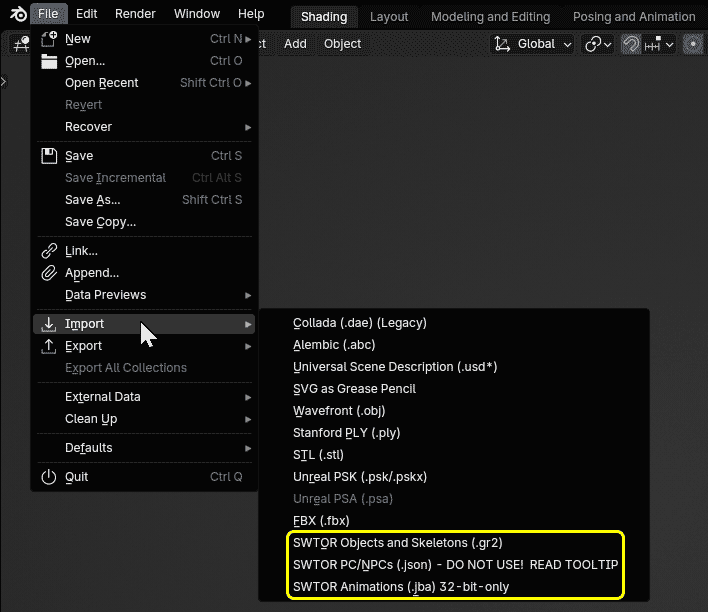
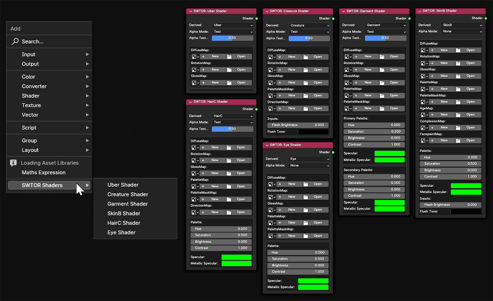
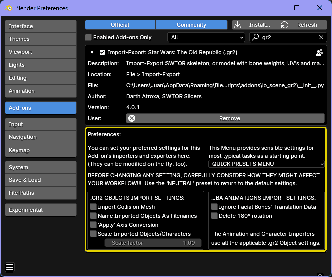
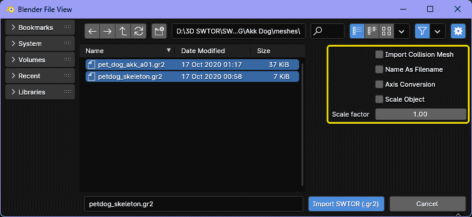
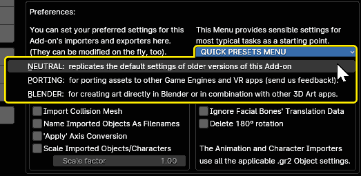
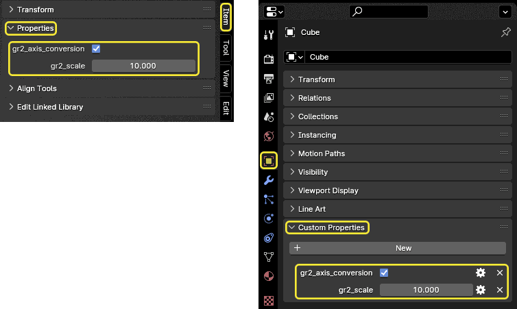
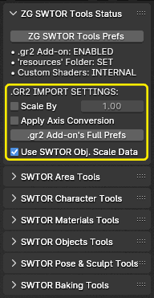

# SWTOR Granny2 (.gr2) Import/Export Add-on for Blender 2.8 to 4.4*

**A Blender Add-on that lets us import Star Wars: The Old Republic (SWTOR) 3D models, armatures, and even "one-click" auto-assemble/texture/rig whole Player Characters and NPCs. It requires the use of other tools to extract the assets from the game in the first place, and to obtain PC and NPC description files for auto-assembling them.**

* ### NPC import including Creature-type ones works far better now!
* ### Compatible with Game Update 7.6 and higher's Modernized PC/NPC skin textures (requires downloading the [latest ZG SWTOR Tools Add-on](https://github.com/SWTOR-Slicers/ZG-SWTOR-Tools/releases/latest)).
* ### \*Works with Blender 4.3 and 4.4, but the SWTOR shaders' Alpha Mode menu is inoperative (typically it won't matter). We'll try to solve that later. **We have a 4.4-compatible beta of the ZG SWTOR Tools [here](https://github.com/SWTOR-Slicers/ZG-SWTOR-Tools/releases/tag/v2.0.9-beta)**.

**For more information on this Add-on's usage in combination with the rest of our tools, please consult our [**WikiPedia**](https://github.com/SWTOR-Slicers/WikiPedia/wiki).**


---

- [SWTOR Granny2 (.gr2) Import/Export Add-on for Blender 2.8 to 4.2](#swtor-granny2-gr2-importexport-add-on-for-blender-28-to-42)
  - [Download](#download)
  - [Installation](#installation)
  - [Description](#description)
    - [Import/export tools:](#importexport-tools)
    - [Materials Tools:](#materials-tools)
  - [Settings](#settings)
    - [About SWTOR's 3D models and Blender.](#about-swtors-3d-models-and-blender)
    - [.gr2 objects/armatures/characters import settings:](#gr2-objectsarmaturescharacters-import-settings)
    - [.jba animations import settings:](#jba-animations-import-settings)
    - [.json character import settings:](#json-character-import-settings)
    - [Preset settings menu:](#preset-settings-menu)
  - [Paper-trailing.](#paper-trailing)
  - [Using other Add-ons that depend on this one.](#using-other-add-ons-that-depend-on-this-one)
  - [About the older, "Legacy Materials" version of this add-on.](#about-the-older-legacy-materials-version-of-this-add-on)
  - [Using this Add-on from your own scripts and Add-ons](#using-this-add-on-from-your-own-scripts-and-add-ons)
    - [Available Operators.](#available-operators)
    - [Custom Scene Property with feedback about the calls' results.](#custom-scene-property-with-feedback-about-the-calls-results)
- [Current state of the project.](#current-state-of-the-project)

---

**IF THE NEW PREFERENCES SETTINGS ARE LEFT ALONE, IT BEHAVES LIKE PREVIOUS VERSIONS: NO NEED TO ADJUST ANYTHING!**. And if we do and we mess up things, we can use the **'Neutral' preset** to go back to the old behavior.

**These new features can be big timesavers, but we better think how they might impact our workflow before playing with them, specially if we had many SWTOR models already collected and set in Blender projects and asset libraries.**

## Download

[**DOWNLOAD THE LATEST RELEASE FROM HERE**](https://github.com/SWTOR-Slicers/Granny2-Plug-In-Blender-2.8x/releases/latest). It's the ``io_scene_gr2.zip`` file in the assets list. **DON'T UNZIP IT!** Blender directly handles it as such .zip file.

## Installation

Install it in your Blender app **[through the usual means](https://docs.blender.org/manual/en/latest/editors/preferences/addons.html)**: `Edit menu > Preferences > Add-ons > Install > Enable`. In Blender 4.2 or higher it can be directly dragged and dropped onto Blender's window.  
**If you had a previous version of the add-on installed, disable and remove it first**.

**If Blender is set to a language different to English, set it to English for now**. We've noticed that Blender translates to other languages elements that other apps typically wouldn't, such as shader nodes' names, which breaks some of our Add-ons. There are ways to solve that, but we have yet to implement and test them.

## Description

This add-on provides Blender with several import/export and materials features for **Star Wars: The Old Republic** (**SWTOR**) 3D assets (typically extracted from the game's files via the **[Slicers GUI](https://github.com/SWTOR-Slicers/WikiPedia/wiki/Installing-Slicers-GUI-and-extracting-SWTOR-game-assets)** app).



### Import/export tools:
* **SWTOR .gr2 objects and armatures import:**  
  Imports SWTOR's specific flavor of the .gr2 ("granny") 3D model format, including rigging data (vertex groups, weights) and armatures ("skeletons"). **It can import multiple files at once**.  
**SWTOR 32-bit and 64-bit-compatible**.

* **SWTOR .json character data import:**  
  Imports .json files generated by TORCommunity.com's Character Designer and NPC database describing all the assets and data necessary to auto-assemble and auto-texture a Player Character or a NPC.  **It can be used directly, but that isn't recommended, as it won't gather the assets by itself, and SWTOR Game Update 7.6' modernized PC/NPC skins require correcting the json data** (**other add-ons' Character Assemblers do all that, save a corrected .json file, and then call this tool under the hood**, all in a more user-friendly manner), . **It's presence here is mostly as a diagnosing tool**.  
  **Please check [our guides in this Github's Wiki](https://github.com/SWTOR-Slicers/WikiPedia/wiki/locating-swtor-characters-assets-automatically) before trying it!** 
  **SWTOR 32-bit and 64-bit-compatible**.

* ***SWTOR .jba animations import:**  
Imports and applies SWTOR's .jba animation files. It has some issues but it mostly works.  
  **SWTOR 32-bit-compatible only. The old 32-bit .jba files can be downloaded from [here](https://drive.google.com/drive/folders/1hItkqGGX2ut9FMslTrxQV5GahbHYqT7F)**.
  

* **(THE SWTOR .CLO PHYSICS DATA IMPORT IS HIDDEN FOR THE TIME BEING:**  
It was meant for converting .clo physics-based bones data (clothes, hair, Twi'lek lekku, etc.) to Blender physics simulations instead of using bones as the game does, but it simply wasn't working. We'll try to give it another stab in the future. If you want explore the issue, take into account that the current 64-bit version of the file format introduced such severe changes that the old 32-bit .jba files are probably the best to deal with. **They can be downloaded from [here](https://drive.google.com/drive/folders/1hItkqGGX2ut9FMslTrxQV5GahbHYqT7F)**)

The Add-on also allows us to export objects back to their original format. Sadly, this is of very little use at the moment, as **our game modding tools aren't compatible with SWTOR 64-bit and we don't expect any progress in the medium term**).

* **SWTOR 32-bit .gr2 objects export:**  
  Exports SWTOR's specific flavor of the .gr2 ("granny") 3D model format. **SWTOR 32-bit-compatible**.

* **SWTOR 64-bit .gr2 objects export:**  
  Exports SWTOR's specific flavor of the .gr2 ("granny") 3D model format. **SWTOR 64-bit-compatible**.

**THIS ADD-ON ISN'T COMPATIBLE WITH .gr2 FILES FROM OTHER GAMES**. SWTOR's version of the "Granny" format was too heavily customized by BioWare.

### Materials Tools:
**This Add-on also produces a series of Shader Nodegroups that replicate SWTOR's materials system**. They allow for using the game's texture files and materials information without requiring any previous manipulation in a third party painting app: the Shaders do all the channel massaging involved (turning "green" normal maps to "purple", etc.). Also, they use custom-built panel interfaces to make their use easy on the novice.

The shaders are assigned on the fly when importing .json character data files for auto-assembling, and are also available through Blender's Shader Editor's Add menu. Other Add-ons of ours further automate their use.



## Settings

**This Add-on comes now with a series of 'quality-of-life' settings** that, for certain uses of SWTOR assets (artistic, mostly), can save us a lot of work.

 **THE ADD-ON'S DEFAULT SETTINGS ARE PERFECTLY FINE** for having everything work as expected (**they match the behavior of previous versions**). Set to those, our other Add-ons (Character Assembler, Area Assembler, ZG SWTOR Tools) won't notice any difference.

**All settings have tooltips explaining their functions**. They are about dealing with the fact that SWTOR game assets usually come in sizes, axis order schemes, and other details that require changes to be able to work with some of Blender's more advanced features: physics simulations, non-SWTOR armatures-based custom rigs, etc., which need things such as real world-like sizes or no 'soft' transforms getting in the way.




**(All these settings can be changed on the fly for any specific import, as they show up in the importers' File Browsers)**



### About SWTOR's 3D models and Blender.

**SWTOR uses decimeters as its distance unit** instead of meters (that solves some precision issues typical in the videogames world). **It also uses a "y-is-up" coordinate system**.

  **Blender favors meters or feet as its scenes' distance units, instead**, to the point that some processes, such as cloth simulations and automatic weighting from bones, will break or fail if the objects involved don't have reasonable real world sizes in those units (at least temporarily while executing those processes). Also, and this is a bit of a rarity in the animation-oriented 3D apps world, **it uses a "z-is-up" coordinate system**.

**So, when one imports SWTOR objects with the .gr2 importer set to neutral settings, they show up a tenth of the size we might expect them to have. Also, they all happen to have a rotation of 90º in the x-axis despite standing upright**. Without it, they would appear tumbled backwards.

This is not much of an issue. Everything appears natural, if tiny (we might have to adjust the View settings' Clip Start to 0.01 to avoid clipping through the models when we get really close to faces). We can also scale them up, temporarily or long term, to get them up to real world sizes (a x10 factor usually suffices).

But the moment we want to do advanced or complicated things (constraining extra armatures to SWTOR ones' bones, mixing assets from outside the game world…), **we *might* want to do some "Apply Transformations" (with special settings available in Blender's Undo Box) to get all those issues permanently sorted out (at the object's mesh level instead of at merely the object level) so that the models work as if they had been created in Blender**.

**It's something that we might never need**, or we might be needing all the time, hence the following settings:

### .gr2 objects/armatures/characters import settings:
* **Import Collision Mesh**: old option that used to only be available in the importer's file browser. Imports a box surrounding the object that the game uses to keep players from walking through the object. It might be of interest when porting SWTOR objects to other 3D engines.

* **NPC Gear uses skin**: as the paths.json files describing **non-Creature NPCs (that is, NPCs that use armor parts the same way PCs do)** exported by TORCommunity.com lack a flag indicating if armor parts having a second material use a skin one, this option forces the importer to use it. This seems to be the most typical case (e.g., cantina dancer NPCs), so, it's ticked by default.
  
  It doesn't affect PCs or Creature-type NPCs (single or two mesh-only NPCs). 
* **Name Imported Objects as Filenames**: typically, the imported object's (or, if the file holds several meshes, its main mesh's) internal "art name" matches the filename, but not always, which leads to issues if using the former. Ticking this checkbox solves, for example, a name mismatch in Nautolan heads' tentacles straps that crashes their assembling.
  
  The resulted Blender object's mesh's name is always the internal "art name", which is a way to become aware of such mismatches.
* **'Apply' Axis Conversion**: does the Z-is-Up x=90º rotation at the mesh level instead of at the object level, which spares us dealing with rotation inheritance issues.
* **Scale Imported Objects/Characters**: scales all object/armature imports by a factor at the mesh level, which spares us dealing with scale inheritance issues.
* **Scale factor**: the one applied when the aforementioned option is activated.

The .gr2 importer annotates the imported objects with the axis and scale data so that other tools can be aware of those and act accordingly, such as when importing characters or applying animations.

### .jba animations import settings:

* **Ignore Facial Bones' Translation data**: old option that used to be only available in the importer's file browser. That data doesn't work well and makes a mess of the characters' face, so, typically we tick it.
* **Delete 180º Rotation**: deletes the 'bip01' bone's keyframes and changes its rotation so that animations don't make the characters face away from us.

The .jba importer uses the skeleton object's annotated axis and scale settings to scale the animation's translation data accordingly. If unavailable (because of, for example, being older than this add-on's update), it'll use the .gr2 importer' current scale and axis settings instead.

### .json character import settings:

There are none, as they simply follow the .gr2 import ones.

### Preset settings menu:

Meant as sensible values starting points. The menu's chosen option, by itself, isn't meant to stay visible once chosen, as any further manual adjustment would make that misleading: it just changes the settings below them, which are what really sticks.



The currently available presets are:

* **NEUTRAL: matches previous versions of the Add-on**. If things get confusing, use this one to get back to the settings' baseline.
* **PORTING: this is a work in progress**. So far, we are choosing to keep the original assets' scale but convert the axis order from SWTOR's "Y is up" to Blender's "Z is up" (hoping that the usual exporters to FBX and such will like it better). **We need your feedback here**, and if you see that we need specific presets for different target apps (Unity-related, Unreal Engine, apps with their own engines, etc.) we can add and name as many porting presets as needed.
* **BLENDER**: "Blender-friendliest", so to speak. This preset is meant for projects that are either going to stay inside Blender or will move to other 3D apps that are just as art-focused and have similar expectations: objects are scaled to equivalent real life-like sizes, axis order is converted to Blender's own, etc., just as if they would have been entirely created in Blender through the usual means, easy to mix and match with assets from other provenances.
  
  That said, if we happen to have a library of imported SWTOR assets already, we would need to decide whether to use these settings for new imports, keep ourselves to the old ones for consistency, or update previous assets to matching characteristics (vía Blender's Apply operators or the ZG SWTOR Tools variant). **Testing before going all in is extremely recommended**.


## Paper-trailing.

Given the potential impact of some of those settings, it's convenient to annotate the affected objects with them, in a manner similar to photography metadata. So, we are adding custom properties to objects, which other Add-ons and scripts (and us) can read and take into consideration, even change them manually if some processes make that advisable. So far, we are having:
* `gr2_axis_conversion = True or False (True = yes, False = no)`.
* `gr2_scale = 1.0 (neutral), 10.0 (real life-ish), etc.`

They show up in the **`3D Viewport > Sidebar > Item Tab > Properties Panel`** and in the **`Properties Editor > Object Tab > Custom Properties panel`**.




## Using other Add-ons that depend on this one.

…Such as the **SWTOR Area Assembler** and **Character Assembler**, and the **ZG SWTOR Tools**. With the .gr2 Add-on's settings at default values, none of them should notice any difference. At any other values:

* **SWTOR Character Assembler Add-on**: it just assembles the characters importing their objects with those settings, as the .gr2 Add-on is the one doing the heavy lifting.
* **SWTOR Area Assembler Add-on**: here the situation is more complicated, as this Add-on was purposely, *painfully* built to deal with SWTOR's axis order issues. What happens under the hood is that the Assembler temporarily enforces neutral importing settings but does the scaling factor on its own. It doesn't take the axis order conversion into account because it kinda doesn't have to: the way we cater to that is so facepalmy (import all the objects *naturally sideways*, then rotate all 90º), it happens anyway.
* **ZG SWTOR Tools**: here the situation is a bit more nuanced:
  * The Character and Area Assemblers behave just as we've explained for their standalone versions.
  * It's the other tools where things get more complex. There are some that used some eyeballed, sensible fixed values (the thresholds in the Merge Double Vertices tools; the distances and thicknesses in the Displace, Solidify, and Shrinkwrap Modifiers) which now should be multiplied by the scale factor the object was imported with to keep on being that sensible. So:

    * When an object has custom properties, those tools will use them (it can be disabled).

    * If unavailable, they'll use the .gr2 importer settings as reference. To facilitate awareness of the session's conditions, the ZG SWTOR Tools' Status Panel has now a mini-.gr2 Add-on settings section that lets us change them directly (it's just like changing them in the add-on's preferences), plus a button to quickly open its full Preferences panel.

      

## About the older, "Legacy Materials" version of this add-on.

The less accurate (materials-wise), but somewhat baking-friendlier **Legacy version** of the .gr2 Add-on **is not compatible with the 64 bit version of SWTOR's assets**. Its shaders and materials still are, though, and they happen to work with Blender's baking workflow better (speculars bake correctly without manual intervention). Given that, **we added modern-to-legacy material conversion tools to some of our other Add-ons**, without needing to install this one.

(It can still be downloaded from [**this link**](https://github.com/SWTOR-Slicers/Granny2-Plug-In-Blender-2.8x/releases/tag/v.3.0), though)


## Using this Add-on from your own scripts and Add-ons

The same way we have our other Add-ons call this one under the hood, you can call it from your own own scripts and Add-ons and even have them receive feedback from it.

### Available Operators.

* **.gr2 objects importer**: imports .gr2 objects and armatures ("skeletons", which are .gr2 objects too). Can import multiple files at once:
  
  ```
  bpy.ops.import_mesh.gr2(filepath = '',
                          import_collision = False,
                          name_as_filename = True,
                          scale_object = False,
                          scale_factor = 1.0,
                          apply_axis_conversion = False,
                          enforce_neutral_settings = False,
                          job_results_rich = False,
                          job_results_accumulate = False,
                          )

  (Actual default values depend on the Add-on's
  Preferences' settings at the moment of execution)

  Keyword Arguments:
      
    * Required for single file imports:

        filepath (str):
                Filepath of .gr2 file to import.

    * Required for multiple files imports (it needs to be fed
    the files' names separately from the directory, simulating
    the process of selecting multiple files in the File Browser
    after choosing the importer in Blender's Import menu. that
    means that it can import multiple files with one call as
    long as they reside in the same directory).

        files (OperatorFileListElement):
                Needs the files' names (with their extensions)
                collected as this specific Blender collection type.

        directory (str):
                the common directory to all the files
                we want to import, as a string.


        To go from a simple list of full filepath strings to the way
        Blender wants the parameters to be set, we could do:

        # Convert a list of objects' filepaths to import:
        multiple_filepaths_list = [<filepath_1>, <filepath_2>, ...]

        # …into an OperatorFileListElement collection of filenames:
        files_list = [bpy.types.OperatorFileListElement(name=os.path.basename(path))
                      for path in multiple_filepaths_list]

        # …and their common directory path:
        files_common_dir = os.path.dirname(file_paths[0])

        # The call as such would look like this:
        bpy.ops.import_mesh.gr2(files=files_list, directory=files_common_dir, <other params>)


    * Optional:

        import_collision (bool):
                Import objects' collision boxes, if any.

        name_as_filename (bool):
                Name imported objects as per their filenames
                instead of using their internal 'art names'
                (they usually match but there are exceptions).
                If a file contains multiple meshes, this is
                only applied to the first one.

                (The Blender object's mesh name is always
                equal to the internal "art name")

        scale_object (bool):
                Scale objects at the mesh level.

        scale_factor (float):
                Scaling factor for the scale_object feature.

        apply_axis_conversion (bool):
                Convert to Blender's 'Z-is-up' axis order
                at the mesh level instead of using
                an object-level x=90º transformation.

        enforce_neutral_settings (bool):
                Temporarily disregard preferences and use
                the "neutral" settings (the Add-on acts as
                its older versions during the current call).

        job_results_rich (bool):
                Include filepaths/imported objects data, too,
                in bpy.context.scene.io_scene_gr2_last_job
                (see next section on reporting jobs results).

        job_results_accumulate (bool):
                Accumulate info from multiple Operator calls
                in bpy.context.scene.io_scene_gr2_last_job
                (see next section on reporting jobs results).
  ```


* **.json importer**: imports `paths.json` files describing Player Characters or NPCs' objects and textures needed to auto-assemble them. These files are exported by **[TORCommunity.com's Character Designer](https://github.com/SWTOR-Slicers/WikiPedia/wiki/Using-TORCommunity-Character-Designer)** tool and by that site's **[database of NPCs' 3D Viewers](https://github.com/SWTOR-Slicers/WikiPedia/wiki/Using-TORCommunity-NPCs-Database)**. Note that this Operator won't do the gathering of assets into the requisite directories: they have to be pre-populated before its use. That makes it maybe not very practical as a standalone Operator for now.

  ```
  bpy.ops.import_mesh.gr2_json(filepath = '',
                               import_collision = False,
                               npc_uses_skin = True,
                               name_as_filename = True,
                               scale_object = False,
                               scale_factor = 1.0,
                               apply_axis_conversion = False,
                               enforce_neutral_settings = False,
                               job_results_rich = False,
                               job_results_accumulate = True,
                               )
  
  (Actual default values depend on the Add-on's
  Preferences' settings at the moment of execution)

  Keyword Arguments:
      
    * Required:

        filepath (str):
                Filepath of .gr2 file to import.

    * Optional (these optional KWargs are .gr2 import ones, to
      allow overriding the Add-on's Preferences' settings and
      the way they affect the actual importing of the
      character's objects):

        import_collision (bool):
                Import objects' collision boxes, if any.
        
        npc_uses_skin (bool):
                Use the SkinB shader in non-Creature-type NPC
                armor parts's 2nd materials (if any). If False,
                it uses the Garment shader instead.

        name_as_filename (bool):
                Name imported objects as per their filenames
                instead of using their internal 'art names'
                (they usually match but there are exceptions).
                If a file contains multiple meshes, this is
                only applied to the first one. Setting it to
                True solves some issues with Nautolan PCs.

                (The Blender object's mesh name is always
                equal to the internal "art name")

        scale_object (bool):
                Scale objects at the mesh level.

        scale_factor (float):
                Scaling factor for the scale_object feature.

        apply_axis_conversion (bool):
                Convert to Blender's 'Z-is-up' axis order
                at the mesh level instead of using
                an object-level x=90º transformation.

        enforce_neutral_settings (bool):
                Temporarily disregard preferences and use
                the default settings (the Add-on acts as
                its older versions during the current call).

        job_results_rich (bool):
                (See next section on reporting jobs' results)
                Include filepaths/imported objects data, too,
                in bpy.context.scene.io_scene_gr2_last_job.

        job_results_accumulate (bool):
                (See next section on reporting jobs' results).
                Accumulate info from multiple Operator calls
                in bpy.context.scene.io_scene_gr2_last_job.
                The Character Assembler sets it to True.

  ```

* **.jba animations importer**: imports 32-bit .jba animation files. It requires an Active armature object (a SWTOR "skeleton" object) as a target.
  
  ```
  bpy.ops.import_animation.jba(filepath = '',
                               ignore_facial_bones = True,
                               scale_animation = False,
                               scale_factor = Float,
                               delete_180 = False,
                               )

  (Actual default values depend on the Add-on's
  Preferences' settings at the moment of execution)

  Keyword Arguments:

    Required Args:

          filepath (str, required):
                    Filepath to animation file to import.

    Optional Args:

          ignore_facial_bones (bool, optional):
                    Ignore the facial bones' translation data
                    and only use their rotation values.
                    RECOMMENDED: True (the importer handles
                    that data very badly).

          scale_animation (bool, optional):
                    Scale animation's translation data.
                    The operator will use the armature object's 'gr2_scale'
                    custom property, if any. If none, it'll use the Preferences
                    settings for scaling imported objects unless this argument
                    contradicts it.

          scale_factor (float, optional):
                    Scaling factor for the scale_animation feature.

          delete_180 (bool, optional):
                    Keeps the animation data from turning the root
                    of the skeleton 180º away from the viewer.
  ```


### Custom Scene Property with feedback about the calls' results.

As Operators can only report success or failure, and importing a single SWTOR .gr2 object file can produce multiple Blender objects (because .gr2 files can contain multiple meshes but Blender only supports single mesh objects), it's interesting to have some means to report results. Typically, we use Blender's custom scene properties for that, but the available property types for data collections or anything more complex are rather cumbersome.

Something we've seen proposed around by frustrated Add-on developers is to use Python's default json module to convert Python dictionary data to .json format text, place it in a custom stringProperty, and have whoever needs to read that data convert it back to a dict. It works quite well.

So, the .gr2 Add-on "publishes" the results of its jobs via the following custom property:

`bpy.context.scene.io_scene_gr2_job_results`

which contains the following Python dict data (before being converted to .json format and back):


```
job_results = {'job_origin'      : "<calling operator's bl_idname>",
               'objs_names'      : [<obj1>, <obj2>, ...],
               'files_objs_names': {<filepath a>: [<<obj1a>, <obj2a>, ...],
                                    <filepath b>: [<obj1b>, <obj2b>, ...],
                                                      ...
                                    },
               }
```
(files_objs_names is only filled if the `job_results_rich` parameter is True, to avoid adding more processing time to potentially very lengthy jobs like the ZG SWTOR Tools Add-on's Area Assembler's ones)

To get it back as a Python dict is as simple as:
```
import bpy
import json

job_results = json.loads(bpy.context.scene.io_scene_gr2_last_job)
```

The objects' names are their current in-Blender `bpy.data.objects` keys, meaning that if Blender gives them .xxx suffixes (.001, .002, etc.) to avoid name collisions, that's what we get in order to avoid any confusion.

If files_objs_names is filled (by setting `job_results_rich` to True):
- filepaths are normalized to Unix-style forward slashes. SWTOR's internal conventions regarding paths are such a horror show that we might as well follow Python's).
- If the files belong to an assets extraction's 'resources' folder, their paths are made relative to it by starting at its 'art' subdirectory without an initial forward slash (that follows SWTOR's own wobbly conventions, and also makes it easy to append to a 'resources' folder path).


# Current state of the project.

* .jba Animation Import (**32 bit-only**) works correctly, mostly. It's issues are:
  * **`ad_`-prefixed additive animations don't work**.
  * **There seems to be a long standing bug** (since the importer's creation, maybe) **that makes turns bigger than 360º glitch**: it can be seen in some of the Twi'lek dances.
  * **Some animations' bone translation data comes up exaggerated, leading to too elongated limbs**. There is a ZG SWTOR Tools that eliminates it and leaves only the rotations, although that might require some touching up to avoid self-intersections (which is a small cost for simple poses).

* **.json Character Import works with SWTOR's new modernized PC/NPC textures as long as ther add-ons' Character Assemblers correct the paths.json data and gather the correct assets**. We are adding support to have this and those tools allow for selecting what assets to use (classic or modernized) and keep both sets in a same character folder.

* Work on .clo Physics Import (**32 bit-only**) is stopped because we are swamped with pending stuff.
