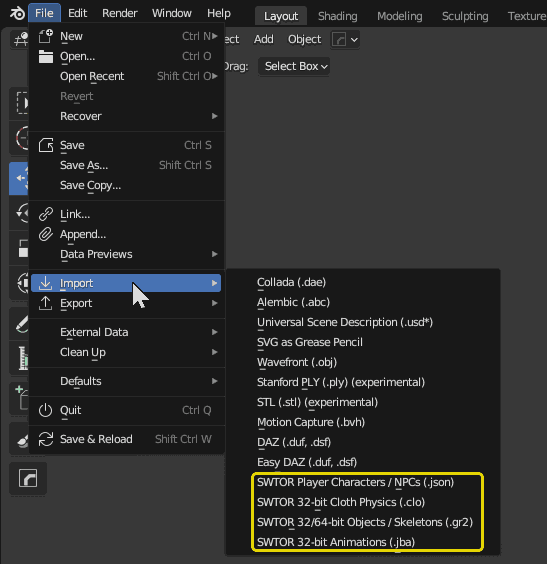
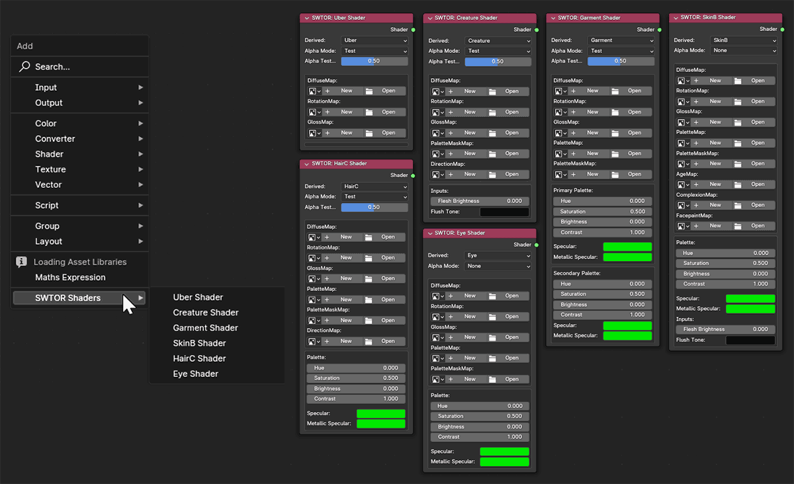
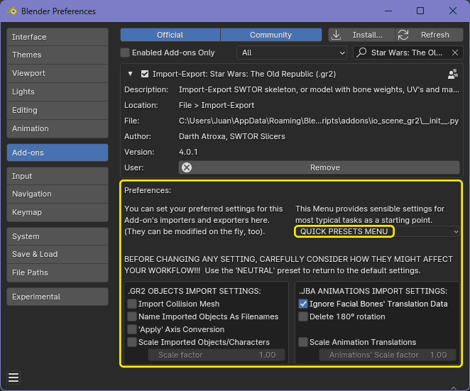
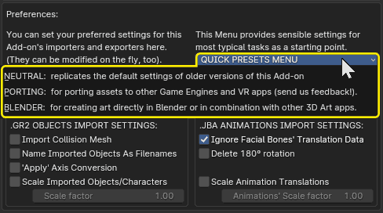
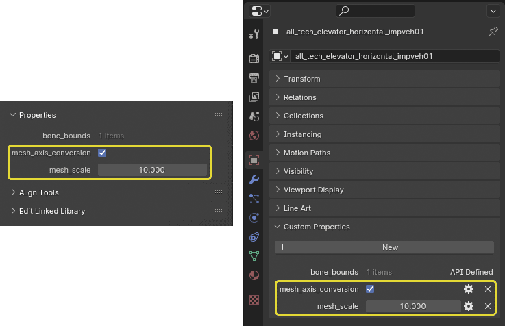
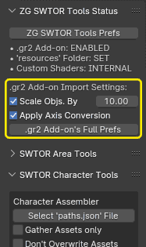

### WARNING: not yet compatible with Blender 4.1.x. We are working on that.

### IMPORTANT NOTICE: [the latest version of this importer add-on](https://github.com/SWTOR-Slicers/Granny2-Plug-In-Blender-2.8x/releases/latest) can import objects, characters, and skeletons from both the old 32-bit version of the game and the current 64-bit one (Game Update 7.2.1 and newer).<br><br>Updating its animation import to support 64-bit files is going to be *quite difficult*. You can use the animation files from a 32 bit game assets extraction instead (you can grab them from [here](https://drive.google.com/drive/folders/1hItkqGGX2ut9FMslTrxQV5GahbHYqT7F)).

**For more information on this Add-on's usage and the rest of our tools, please consult our [**WikiPedia**](https://github.com/SWTOR-Slicers/WikiPedia/wiki).**


# SWTOR Granny2 (.gr2) Import/Export Add-on for Blender 2.8 to 4.0

### New version with new features:
* Blender 4.0.x compatibility (**NOT 4.1.x yet**).
* Preferences and presets for preferred settings.
* Scale and axis order conversion at the mesh level.
* SWTOR Animations without 180º turn.
* Streamlined console output.
* Means to communicate data to other Add-ons and scripts.
* **Solves an issue with TORCommunity.com NPC files  
  that produced broken skin textures**. it's a quick fix  
  that might break something else. Fingers crossed.
* **Auto-imports directionMaps for anisotropic speculars in hair and fur**. 


### If we don't touch anything, it behaves like previous versions.

(And if we do and we mess up things, we can use the **'Neutral' preset** to go back to the older behavior)

**These new features can be big timesavers, but we better think how they might impact our workflow before playing with them, specially if we had many SWTOR models already collected and set in Blender projects and asset libraries.**

## Download

[**Download the latest release from here**](https://github.com/SWTOR-Slicers/Granny2-Plug-In-Blender-2.8x/releases/latest). It's the ``io_scene_gr2.zip`` file in the assets list.  
**DON'T UNZIP IT!** Blender directly handles it as such .zip file. 

## Installation

Install it in your Blender app **[through the usual means](https://docs.blender.org/manual/en/latest/editors/preferences/addons.html)**: `Edit menu > Preferences > Add-ons > Install > Enable`.  
**If you had a previous version of the add-on installed, disable and remove it first**.

## Description

This add-on provides Blender with several import/export and texturing features for **Star Wars: The Old Republic** (**SWTOR**) 3D assets.



### Import/export tools:
* **SWTOR .gr2 objects and armatures import:**  
  Imports SWTOR's specific flavor of the .gr2 ("granny") 3D model format, including rigging data (vertex groups, weights) and armatures ("skeletons"). **It can import multiple files at once**.  
**SWTOR 32-bit and 64-bit-compatible**.

* **SWTOR .json character data import:**  
  Imports .json files generated by TORCommunity.com's Character Designer and NPC database describing all the assets and data necessary to auto-assemble and auto-texture a Player Character or a NPC. **Please check [our guides in this Github's WikiPedia](https://github.com/SWTOR-Slicers/WikiPedia/wiki/locating-swtor-characters-assets-automatically) before trying it!** It can be used directly, but there are other add-ons that do it for us in a more user-friendly manner.  
  **SWTOR 32-bit and 64-bit-compatible**.

* ***SWTOR .jba animations import:**  
Imports and applies SWTOR's .jba animation files. It has some issues but it mostly works.  
  **SWTOR 32-bit-compatible only**.
  
* **SWTOR .clo physics data import (non-functional at the moment):**  
Imports SWTOR's .clo files for converting physics-based bones data (clothes, hair, Twi'lek lekku, etc.) to Blender physics simulations. **Experimental and extremely wonky, expect Kill Bill sirens!** (we are having another attempt at doing something about it, but it'll take its good time)  
  **SWTOR 32-bit-compatible only**.

The Add-on allows us to export objects back to their original format (sadly, this is of very little use at the moment, as **our game modding tools aren't compatible with SWTOR 64-bit and we don't expect any progress in the medium term**).

* **SWTOR 32-bit .gr2 objects export:**  
  Exports SWTOR's specific flavor of the .gr2 ("granny") 3D model format. **SWTOR 32-bit-compatible**.

* **SWTOR 32-bit .gr2 objects export:**  
  Exports SWTOR's specific flavor of the .gr2 ("granny") 3D model format. **SWTOR 64-bit-compatible**.

### Materials Tools:
**This Add-on also produces a series of Shader Nodegroups that replicate SWTOR's materials system**. They allow for using the game's texture files and materials information without requiring any previous manipulation in a third party painting app: the Shaders do all the channel massaging involved (turning "green" normal maps to "purple", etc.). Also, they use custom-built panel interfaces to make their use easy on the novice.

The shaders are assigned on the fly when importing .json character data files for auto-assembling, and are also available through Blender's Shader Editor's Add menu. Other Add-ons of ours further automate their use.



## Settings

**This Add-on comes now with a series of 'quality-of-life' settings** that, for certain uses of SWTOR assets (artistic, mostly), can save us a lot of work. **All settings have tooltips explaining their functions**. They are about dealing with the fact that SWTOR game assets usually come in sizes, axis order schemes, and other details that require changes to be able to work with some of Blender's more advanced features: physics simulations, non-SWTOR armatures-based custom rigs, etc., which need things such as real world-like sizes or no 'soft' transforms getting in the way.

All that said, **the Add-on's default settings are perfectly fine** for having everything work as expected (**they match the behavior of previous versions**). Set to those, our other Add-ons (Character Assembler, Area Assembler, ZG SWTOR Tools) won't notice any difference.



### .gr2 objects/armatures/characters import settings:
* **Import Collision Mesh**: old option that used to be only available in the importer's file browser. 
* **Name Imported Objects as Filenames**: typically, the imported object or its main mesh's internal "art name" matches the filename, but not always, which leads to issues if using the former. Ticking it solves, for example, a name mismatch in Nautolan heads' tentacles strap object that crashes their assembling.  
  
  The resulted Blender object's mesh's name is always the internal "art name", which is a way to become aware of such mismatches.
* **'Apply' Axis Conversion**: does the Z-is-Up x=90º rotation at the mesh level instead of at the object level, which spares us dealing with rotation inheritance issues.
* **Scale Imported Objects/Characters**: scales all object/armature imports by a factor at the mesh level, which spares us dealing with scale inheritance issues.
* **Scale factor**: the one applied when the aforementioned option is activated. 

### .jba animations import settings:

* **Ignore Facial Bones' Translation data**: old option that used to be only available in the importer's file browser. That data doesn't work well, so, typically we ignore it.
* **Delete 180º Rotation**: deletes the 'bip01' bone's keyframes and changes its rotation so that animations don't make the characters face away from us.
* **Scale Animations' Translations**: scales all animation keyframes' translation data by a factor.
* **Animations Scale factor**:**The .jba animation importer's scale factor copies the .gr2 importer's own when that one is modified**, for consistency, but we can still change it manually here. 

### Preset settings menu:

Meant as sensible values starting points. The currently available presets are:

* **NEUTRAL: resets the Add-on to the default settings, matching its older versions**.
* **PORTING: this is a work in progress**. So far, we are choosing to keep the original assets' scale but convert the axis order from SWTOR's "Y is up" to Blender's "Z is up" (hoping that the usual exporters to FBX and such will like it better). **We need your feedback** here, and if you see that we need specific presets for different target apps (Unity-related, Unreal Engine, apps with their own engines, etc.) we can add and name as many porting presets as needed.
* **BLENDER**: "Blender-friendliest", so to speak. This preset is meant for projects that are either going to stay inside Blender or will move to other 3D apps that are just as art-focused and have similar expectations: objects are scaled to equivalent real life-like sizes, axis order is converted to Blender's own, etc., just as if they would have been entirely created in Blender through the usual means, easy to mix and match with assets from other provenances. That said, if we happen to have a library of imported SWTOR assets already, we would need to decide whether to use these settings for new imports, keep ourselves to the old ones for consistency, or update previous assets to matching characteristics (vía Blender's Apply operators). **Testing before going all in is extremely recommended**.

  

## Paper-trailing.

Given the potential impact of some of those settings, it would be good to annotate them in the affected objects, in a manner similar to photography metadata. So, we are adding custom properties to objects, which other Add-ons and scripts (and us) can read and take into consideration, even change if some processes make that advisable. So far, we are having:
* `gr2_axis_conversion = True or False (Bool)`.
* `gr2_scale = a decimal number (float)`.

They show up in the `3D Viewport > Sidebar > Item Tab > Properties Panel` and in the `Properties Editor > Object Tab > Custom Properties panel`.




## Using other Add-ons that depend on this one.

…Such as the SWTOR Area Assembler and Character Assembler, and the ZG SWTOR Tools. With the .gr2 Add-on's settings at default values, none of them should notice any difference. At any other values:

* **SWTOR Character Assembler Add-on**: it just assembles the characters importing their objects with those settings, as the .gr2 Add-on is the one doing the heavy lifting.
* **SWTOR Area Assembler Add-on**: here the situation is more complicated, as this Add-on was purposely, *painfully* built to deal with SWTOR's axis order. What happens under the hood is that the Assembler temporarily enforces neutral importing settings but does the scaling factor on its own. It doesn't take the axis order conversion into account because it kinda doesn't have to: the way we cater to that is so facepalmy (import all the objects *naturally* sideways, then rotate all 90º), it happens anyway.
* **ZG SWTOR Tools**: here the situation is a bit more nuanced:
  * The Character and Area Assemblers behave just as we've explained for their standalone versions.
  * It's the other tools where things get more complex. There are some that used some eyeballed, sensible fixed values (the thresholds in the Merge Double Vertices tools; the distances and thicknesses in the Displace, Solidify, and Shrinkwrap Modifiers) which now ought to be multiplied by the scale factor the object was imported with to keep on being that sensible.

    When an object has a `mesh_scale` custom property, those tools will use it. The issue is what to do when it doesn't have any. It could default to 1.0, or it could use whatever the .gr2 Add-on's preferences are set to at that moment. Quite probably we'll just make those choices explicit via checkboxes.

    To facilitate awareness of the session's conditions, the ZG SWTOR Tools' Status Panel has now a summary of the .gr2 Add-on settings, plus a button to quickly open its Preferences panel.

    

## About the old, "Legacy" version of this add-on.

The less accurate (materials-wise), but somewhat baking-friendlier **Legacy version** of the .gr2 Add-on **is not compatible with the 64 bit version of SWTOR's assets**. Its shaders and materials still are, though, and they happen to work with Blender's baking workflow better (speculars bake correctly without manual intervention). Given that, **weadded modern-to-legacy material conversion tools to some of our other Add-ons**, without needing to install this one.

(It can still be downloaded from [**this link**](https://github.com/SWTOR-Slicers/Granny2-Plug-In-Blender-2.8x/releases/tag/v.3.0), though)


## Using this Add-on from your own scripts and Add-ons

The same way we have our other Add-ons calling this one under the hood, you can call it from your own own scripts and Add-ons and even have them receive feedback from it.

### Available Operators

* **.gr2 objects importer**: imports .gr2 objects and armatures ("skeletons"):
  
  ```
  bpy.ops.import_mesh.gr2(filepath = '',
                          import_collision = False,
                          name_as_filename = True,
                          scale_object = False,
                          scale_factor = 1.0,
                          apply_axis_conversion = False,
                          enforce_neutral_settings = False,
                          job_results_rich = False,
                          job_results_accumulate = False,
                          )

  (Actual default values depend on the Add-on's
  Preferences' settings at the moment of execution)

  Keyword Arguments:
      
    * Required for single file imports:

        filepath (str):
                Filepath of .gr2 file to import.

    * Required for multiple files imports (it needs to be fed
    separate files names and the directory they are in, simulating
    the process of selecting multiple files in the File Browser
    after choosing the importer in Blender's Import menu)

        files (OperatorFileListElement):
                Needs the files' names (with their extensions)
                collected as this specific Blender collection type.

        directory (str):
                the common directory to all the files
                we want to import, as a string.


        To go from a simple list of full filepath strings to the way
        Blender wants the parameters to be set, we could do:

        # From a example list of object filepaths to import:
        multiple_filepaths_list = [<filepath_1>, <filepath_2>, ...]

        # to an OperatorFileListElement collection of filenames:
        files_list = [bpy.types.OperatorFileListElement(name=os.path.basename(path))
                      for path in multiple_filepaths_list]

        # and their common directory path:
        files_common_dir = os.path.dirname(file_paths[0])

        # The call would look like this:
        bpy.ops.import_mesh.gr2(files=files_list, directory=files_common_dir, ...,)


    * Optional:

        import_collision (bool):
                Import objects' collision boxes, if any.

        name_as_filename (bool):
                Name imported objects as per their filenames
                instead of using their internal 'art names'
                (they usually match but there are exceptions).
                If a file contains multiple meshes, this is
                only applied to the first one.

                (The Blender object's mesh name is always
                equal to the internal "art name")

        scale_object (bool):
                Scale objects at the mesh level.

        scale_factor (float):
                Scaling factor for the scale_object feature.

        apply_axis_conversion (bool):
                Convert to Blender's 'Z-is-up' axis order
                at the mesh level instead of using
                an object-level x=90º transformation.

        enforce_neutral_settings (bool):
                Temporarily disregard preferences and use
                the default settings (the Add-on acts as
                its older versions during the current call).

        job_results_rich (bool):
                Include filepaths/imported objects data, too,
                in bpy.context.scene.io_scene_gr2_last_job
                (see next section on reporting jobs results).

        job_results_accumulate (bool):
                Accumulate info from multiple Operator calls
                in bpy.context.scene.io_scene_gr2_last_job
                (see next section on reporting jobs results).
  ```


* **.json importer**: imports `paths.json` files describing the Player Character and non-creature-type NPCs' objects and textures needed to auto-assemble them. These files are exported by **[TORCommunity.com's Character Designer](https://github.com/SWTOR-Slicers/WikiPedia/wiki/Using-TORCommunity-Character-Designer)** tool and by that site's **[database of NPCs' 3D Viewers](https://github.com/SWTOR-Slicers/WikiPedia/wiki/Using-TORCommunity-NPCs-Database)**. Note that this Operator won't do the gathering of assets into the requisite directories: they have to be pre-populated before its use. That makes it maybe not very practical for now.

  ```
  bpy.ops.import_mesh.gr2_json(filepath = '',
                               import_collision = False,
                               name_as_filename = True,
                               scale_object = False,
                               scale_factor = 1.0,
                               apply_axis_conversion = False,
                               enforce_neutral_settings = False,
                               job_results_rich = False,
                               job_results_accumulate = True,
                               )
  
  (Actual default values depend on the Add-on's
  Preferences' settings at the moment of execution)

  Keyword Arguments:
      
    * Required:

        filepath (str):
                Filepath of .gr2 file to import.

    * Optional (these optional KWargs are .gr2 import ones, to
      allow overriding the Add-on's Preferences' settings and
      the way they affect the actual importing of the
      character's objects):

        import_collision (bool):
                Import objects' collision boxes, if any.

        name_as_filename (bool):
                Name imported objects as per their filenames
                instead of using their internal 'art names'
                (they usually match but there are exceptions).
                If a file contains multiple meshes, this is
                only applied to the first one. Setting it to
                True solves some issues with Nautolan PCs.

                (The Blender object's mesh name is always
                equal to the internal "art name")

        scale_object (bool):
                Scale objects at the mesh level.

        scale_factor (float):
                Scaling factor for the scale_object feature.

        apply_axis_conversion (bool):
                Convert to Blender's 'Z-is-up' axis order
                at the mesh level instead of using
                an object-level x=90º transformation.

        enforce_neutral_settings (bool):
                Temporarily disregard preferences and use
                the default settings (the Add-on acts as
                its older versions during the current call).

        job_results_rich (bool):
                Include filepaths/imported objects data, too,
                in bpy.context.scene.io_scene_gr2_last_job
                (see next section on reporting jobs results).

        job_results_accumulate (bool):
                Accumulate info from multiple Operator calls
                in bpy.context.scene.io_scene_gr2_last_job
                (see next section on reporting jobs results).
                RECOMMENDED True FOR CHARACTER ASSEMBLING

  ```

* **.jba animations importer**: imports 32-bit .jba animation files. It requires an Active armature object (a SWTOR "skeleton" object) as a target.
  
  ```
  bpy.ops.import_animation.jba(filepath,
                               ignore_facial_bones,
                               scale_animation,
                               scale_factor,
                               delete_180,
                               )
  Required Args:

        filepath (str, required):
                  Filepath to animation file to import.

  Optional Args:

        ignore_facial_bones (bool, optional):
                  Ignore the facial bones' translation data
                  and only use their rotation values.

        scale_animation (bool, optional):
                  Scale animation's translation data.
                  The operator will use the armature object's 'scale_factor'
                  custom property, if any. If none, it'll use the Preferences
                  settings for scaling imported objects unless this argument
                  is in use.

        scale_factor (float, optional):
                  Scaling factor for the scale_animation feature.

        delete_180 (bool, optional):
                  Keeps the animation data from turning the root
                  of the skeleton 180º away from the viewer.
  ```


#### Custom Scene Property with feedback about the calls' results

As Operators can only report success or failure, and importing a single SWTOR .gr2 object file can produce multiple Blender objects (because .gr2 files can contain multiple meshes but Blender only supports single mesh objects), it's interesting to have some means to report results. Typically, we use Blender's custom scene properties for that, but the available property types for data collections or anything more complex are rather cumbersome.

Something we've seen proposed around by frustrated Add-on developers is to use the json module in Blender's Python interpreter to convert Python dictionary data to .json format text, place it in a custom stringProperty, and have whoever needs that data convert it back to a dict. It works quite well.

So, the .gr2 Add-on "publishes" the results of its jobs via the following custom property:

`bpy.context.scene.io_scene_gr2_job_results`

which contains the following Python dict data (before being converted to .json format):


```
job_results = {'job_origin'      : "<calling operator's bl_idname>",
               'objs_names'      : [<obj1>, <obj2>, ...],
               'files_objs_names': {<filepath a>: [<list of object names>],
                                    <filepath b>: [<list of object names>],
                                                      ...
                                    },
               }
```
(files_objs_names is only filled if the `job_results_rich` parameter is True, to avoid adding more processing time to potentially very lengthy jobs like the Area Assembler's)

To get it back as a Python dict it is as simple as:
```
import bpy
import json

job_results = json.loads(bpy.context.scene.io_scene_gr2_last_job)
```

The objects' names are their current in-Blender `bpy.data.objects` keys, meaning that if Blender gives them .xxx suffixes (.001, .002, etc.) to avoid name collisions, that's what we get in order to avoid any confusion.

If files_objs_names is filled (by setting `job_results_rich` to True):
- filepaths are normalized to Unix-style forward slashes. SWTOR's internal conventions regarding paths are
  such a horror show that we might as well follow Python's).
- If the files belong to an assets extraction's 'resources' folder, their paths are made relative to it by starting at its 'art' subdirectory (without an initial forward slash).


# Current state of the project:

## The Blender 4.1 showstopper:
* **Several deprecations in bmesh break the `io_scene_gr2\ops\import_gr2.py` object importer module** (See [4.1's list of API changes](https://developer.blender.org/docs/release_notes/4.1/python_api/)). **They are marked with a "DEPRECATED" comment in the code** so that they can be quickly located via text search. These are the three lines and what seems to be relevant to them in Blender's 4.1 changelog.

  * **`bmesh.create_normals_split()`**  
  
    "**create_normals_split**, calc_normals_split, and free_normals_split **are removed, and are replaced by the simpler Mesh.corner_normals collection property**. Since it gives access to the normals cache, it is automatically updated when relevant data changes."
    
    ---

  * **`bmesh.loops[loop_index].normal = [v.normals.x, v.normals.y, v.normals.z]`**
  
    "**MeshLoop.normal is now a read-only property. Custom normals should be created by normals_split_custom_set or normals_split_custom_set_from_vertices**."
    
    ---

  * **`bmesh.use_auto_smooth = True`**
  
    "use_auto_smooth is removed. **Face corner normals are now used automatically if there are mixed smooth vs. not smooth tags. Meshes now always use custom normals if they exist**.  

    **auto_smooth_angle is removed. Replaced by a modifier (or operator) controlling the "sharp_edge" attribute**. This means the mesh itself (without an object) doesn't know anything about automatically smoothing by angle anymore."

  (Commenting these lines out lets objects import (without normals and smoothing) with no more exceptions)

## Other than that:
* .jba Animation Import (**32 bit-only**) works correctly, **BUT: there seems to be a long standing bug** (since the importer's creation, maybe) **that makes turns bigger than 360º glitch**: it can be seen in some of the Twi'lek dances.
* .clo Physics Import (**32 bit-only**) doesn't work as intended, but the seeds of a simpler physics-driven bones importer is there if we work on it.


